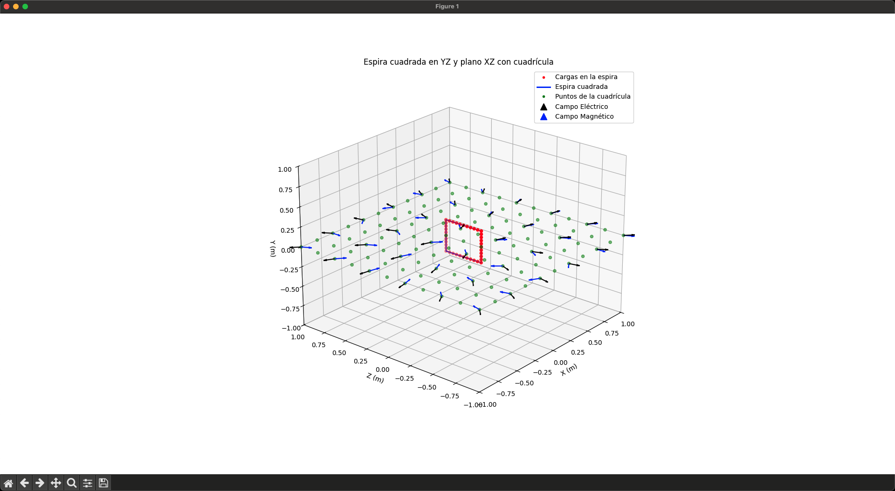
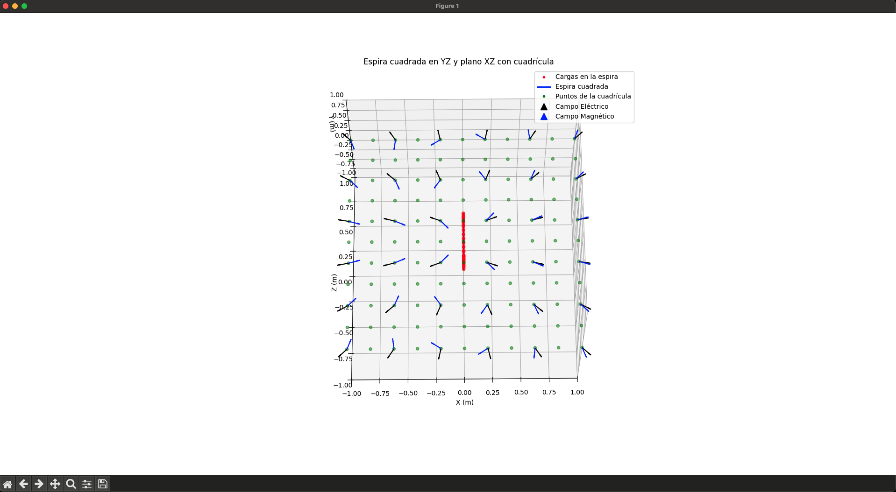
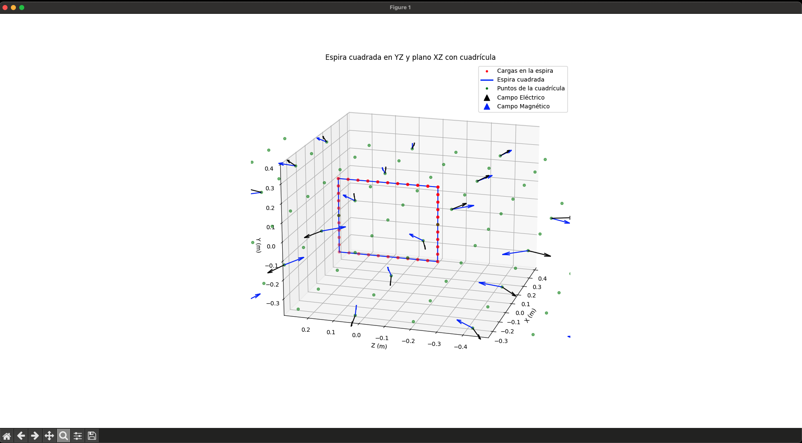

# Principio de Superposición de Coulomb y Ley de Biot-Savart

Este proyecto calcula y visualiza los campos eléctrico y magnético generados por una espira cuadrada situada en el plano YZ. Se consideran cargas puntuales distribuidas uniformemente a lo largo de la espira y una corriente eléctrica que fluye por ella. Los campos se calculan en puntos de una cuadrícula situada en el plano XZ, que atraviesa la mitad de la espira.

<p align="center">
  
</p>

## Contenido

- Instalación
- Ejecución
- Generación de archivos de datos
- Visualización de los campos
- Explicación detallada del código
- main.py
- graficar.py
- Resultados esperados
- Notas adicionales

## Instalación

Para ejecutar este proyecto, necesitas tener instalado Python 3 y las librerías listadas en requirements.txt.

1.	Crear un entorno virtual:
```bash
python3 -m venv venv
```

2.	Activar el entorno virtual:

```bash
# En Unix o MacOS:
source ./venv/bin/activate

# En Windows:
venv\Scripts\activate
```

3.	Instalar las dependencias:

```bash
pip install -r requirements.txt
```

## Ejecución

### Generación de archivos de datos

Ejecuta main.py para calcular los campos eléctrico y magnético y guardar los resultados en archivos de texto:

```bash
python main.py
```

Este script generará dos archivos:

- campo_electrico.txt: Contiene los valores del campo eléctrico en cada punto de la cuadrícula.
- campo_magnetico.txt: Contiene los valores del campo magnético en cada punto de la cuadrícula.

### Visualización de los campos

Ejecuta graficar.py para visualizar la espira, la cuadrícula y los campos:
```bash
python graficar.py
```

Esto abrirá una ventana con una gráfica interactiva que muestra:

- La espira cuadrada en el plano YZ.
- Los puntos de la cuadrícula en el plano XZ.
- Los vectores del campo eléctrico (en negro).
- Los vectores del campo magnético (en azul).

<p align="center">
  
  
</p>


## Explicación detallada del código

A continuación, se presenta una explicación detallada de los scripts main.py y graficar.py para facilitar su comprensión.

### main.py

Este script calcula los campos eléctrico y magnético en los puntos de una cuadrícula situada en el plano XZ, generados por una espira cuadrada situada en el plano YZ.

#### Importación de librerías y definición de constantes

```python
import numpy as np

# Constantes físicas

k = 8.988e9  # Constante de Coulomb (N·m²/C²)
mu0 = 4 * np.pi * 1e-7  # Permeabilidad magnética del vacío (T·m/A)
```

- NumPy se utiliza para operaciones matemáticas y manejo de arrays.
- k es la constante de Coulomb utilizada en el cálculo del campo eléctrico.
- mu0 es la permeabilidad magnética del vacío, necesaria para calcular el campo magnético.

#### Parámetros de la espira y de discretización

```python
# Parámetros de la espira y cargas
q = 12e-9  # Carga de cada punto en la espira (12 nC)
I = 4  # Corriente que circula por la espira (4 A)
N_cargas_por_lado = 10  # Número de cargas puntuales por lado de la espira
N_segmentos_por_lado = 10  # Número de segmentos por lado para calcular el campo magnético
lado = 0.4  # Longitud de cada lado de la espira (metros)
half_lado = lado / 2  # Mitad de la longitud del lado
```

- Se divide cada lado de la espira en cargas puntuales y segmentos para aproximar los campos.

#### Generación de las posiciones de las cargas en la espira
```python
# Inicializamos la lista de posiciones de las cargas
cargas_posiciones = []

# Lado inferior (de (-0.2, -0.2) a (0.2, -0.2)) en el plano YZ
# Se varia la coordenada Y y se mantiene Z constante
y_inf = np.linspace(-half_lado, half_lado, N_cargas_por_lado, endpoint=False)
z_inf = np.full(N_cargas_por_lado, -half_lado)
for y, z in zip(y_inf, z_inf):
    cargas_posiciones.append([0, y, z])
```

- Se genera una lista de posiciones para las cargas en cada lado de la espira.
- Las cargas se distribuyen uniformemente a lo largo de los lados.
- La coordenada X es cero, ya que la espira está en el plano YZ.

El mismo procedimiento se repite para los otros tres lados (derecho, superior e izquierdo) de la espira.

#### Conversión de la lista de cargas a un array NumPy

```python
cargas_posiciones = np.array(cargas_posiciones)
```

- Facilita las operaciones matemáticas posteriores.

#### Generación de los segmentos de corriente para el cálculo del campo magnético

```python
segmentos_posiciones = []

# Lado inferior
y_inf_seg = np.linspace(-half_lado, half_lado, N_segmentos_por_lado + 1)
z_inf_seg = np.full(N_segmentos_por_lado + 1, -half_lado)
for i in range(N_segmentos_por_lado):
    inicio = np.array([0, y_inf_seg[i], z_inf_seg[i]])
    fin = np.array([0, y_inf_seg[i+1], z_inf_seg[i+1]])
    segmentos_posiciones.append((inicio, fin))
```

- Se crean segmentos entre puntos consecutivos para aproximar la espira continua.
- Cada segmento se define por su punto inicial y final.

Este proceso se repite para los otros tres lados de la espira.

#### Generación de la cuadrícula de puntos en el plano XZ

```python
grid_size = 11  # Número de puntos en cada eje de la cuadrícula
x_grid = np.linspace(-1, 1, grid_size)
z_grid = np.linspace(-1, 1, grid_size)
X, Z = np.meshgrid(x_grid, z_grid)
Y = np.zeros_like(X)  # Coordenada Y es cero para el plano XZ
```

- Se crea una malla de puntos en el plano XZ donde se calcularán los campos.

#### Cálculo y almacenamiento del campo eléctrico

```python
with open('campo_electrico.txt', 'w') as file_e:
    for i in range(grid_size):
        for j in range(grid_size):
            punto = np.array([X[i, j], Y[i, j], Z[i, j]])
            campo_total = np.zeros(3)
            for carga_pos in cargas_posiciones:
                r_vector = punto - carga_pos
                r_mag = np.linalg.norm(r_vector)
                if r_mag == 0:
                    continue  # Evitamos división por cero
                r_hat = r_vector / r_mag
                campo = (k * q / r_mag**2) * r_hat
                campo_total += campo
            file_e.write(f"Punto ({X[i,j]:.2f}, {Y[i,j]:.2f}, {Z[i,j]:.2f}): "
                         f"Campo Eléctrico = ({campo_total[0]:.2e}, {campo_total[1]:.2e}, {campo_total[2]:.2e})\n")
```

- Para cada punto de la cuadrícula, se calcula el campo eléctrico total sumando las contribuciones de cada carga puntual utilizando la ley de Coulomb.
- Los resultados se guardan en campo_electrico.txt.

#### Cálculo y almacenamiento del campo magnético

```python
with open('campo_magnetico.txt', 'w') as file_b:
    for i in range(grid_size):
        for j in range(grid_size):
            punto = np.array([X[i, j], Y[i, j], Z[i, j]])
            campo_total = np.zeros(3)
            for segmento in segmentos_posiciones:
                r0 = segmento[0]
                r1 = segmento[1]
                dl = r1 - r0
                r = punto - r0
                r_mag = np.linalg.norm(r)
                if r_mag == 0:
                    continue
                dB = (mu0 * I / (4 * np.pi)) * np.cross(dl, r) / r_mag**3
                campo_total += dB
            file_b.write(f"Punto ({X[i,j]:.2f}, {Y[i,j]:.2f}, {Z[i,j]:.2f}): "
                         f"Campo Magnético = ({campo_total[0]:.2e}, {campo_total[1]:.2e}, {campo_total[2]:.2e})\n")
```

- Se utiliza la ley de Biot-Savart para calcular el campo magnético en cada punto de la cuadrícula.
- Las contribuciones de cada segmento de corriente se suman para obtener el campo total.
- Los resultados se guardan en campo_magnetico.txt.

#### Mensajes informativos

```python
print("El cálculo del campo eléctrico ha finalizado y los resultados se han guardado en 'campo_electrico.txt'.")
print("El cálculo del campo magnético ha finalizado y los resultados se han guardado en 'campo_magnetico.txt'.")
```

- Indican que los cálculos han concluido y dónde se encuentran los resultados.

### graficar.py

Este script visualiza la espira cuadrada, los puntos de la cuadrícula y los campos eléctrico y magnético.

### Importación de librerías y definición de constantes

```python
import numpy as np
import matplotlib.pyplot as plt
from mpl_toolkits.mplot3d import Axes3D
from matplotlib.lines import Line2D

# Constantes físicas (idénticas a las de main.py)
k = 8.988e9
mu0 = 4 * np.pi * 1e-7
```

Parámetros y generación de la espira y la cuadrícula

- Los parámetros y la generación de la espira y la cuadrícula son idénticos a los de main.py, asegurando coherencia entre los cálculos y la visualización.

#### Visualización de la espira y la cuadrícula

```python
fig = plt.figure(figsize=(10, 8))
ax = fig.add_subplot(111, projection='3d')

# Graficamos las cargas en la espira cuadrada
ax.scatter(cargas_x, cargas_z, cargas_y, color='red', label='Cargas en la espira')

# Graficamos los segmentos de la espira
for segmento in segmentos_posiciones:
    xs = [inicio[0], fin[0]]
    zs = [inicio[2], fin[2]]  # Intercambio para ajustar ejes
    ys = [inicio[1], fin[1]]
    ax.plot(xs, zs, ys, color='blue')

# Graficamos la cuadrícula en el plano XZ
ax.scatter(X, Z, Y, color='green', s=20, alpha=0.5, label='Puntos de la cuadrícula')
```

- Se intercambian las coordenadas Y y Z al graficar para que el eje vertical sea Y.
- La espira se representa con líneas azules y las cargas con puntos rojos.
- Los puntos de la cuadrícula se muestran en verde.

#### Configuración de la gráfica

```python
ax.set_xlabel('X (m)')
ax.set_ylabel('Z (m)')
ax.set_zlabel('Y (m)')
ax.set_xlim([-1, 1])
ax.set_ylim([-1, 1])
ax.set_zlim([-1, 1])
ax.view_init(elev=0, azim=-90)
```

- Se ajustan las etiquetas y límites de los ejes para una mejor visualización.
- ax.view_init ajusta el ángulo de la cámara.

#### Cálculo y visualización del campo eléctrico

```python
# Cálculo del campo eléctrico (idéntico al de main.py)
...

# Normalización y graficación de los vectores del campo eléctrico
E_magnitude = np.linalg.norm(E_total, axis=2)
E_magnitude[E_magnitude == 0] = 1e-20
E_normalized = E_total / E_magnitude[:, :, np.newaxis]

# Graficamos los vectores del campo eléctrico
E_quiver = ax.quiver(X[skip], Z[skip], Y[skip],
                     E_normalized[skip][:, :, 0], E_normalized[skip][:, :, 2], E_normalized[skip][:, :, 1],
                     length=0.1, color='black', normalize=True)
```

- Se calcula el campo eléctrico en los puntos de la cuadrícula.
- Los vectores se normalizan para una visualización consistente.
- Se utiliza ax.quiver para graficar los vectores.

#### Cálculo y visualización del campo magnético

```python
# Cálculo del campo magnético (idéntico al de main.py)
# ...

# Normalización y graficación de los vectores del campo magnético
B_magnitude = np.linalg.norm(B_total, axis=2)
B_magnitude[B_magnitude == 0] = 1e-20
B_normalized = B_total / B_magnitude[:, :, np.newaxis]

# Graficamos los vectores del campo magnético
B_quiver = ax.quiver(X[skip], Z[skip], Y[skip],
                     B_normalized[skip][:, :, 0], B_normalized[skip][:, :, 2], B_normalized[skip][:, :, 1],
                     length=0.1, color='blue', normalize=True)
```

- Se calcula y grafica el campo magnético de manera similar al campo eléctrico.
- Los vectores del campo magnético se muestran en azul.

#### Añadir leyenda y mostrar la gráfica

```python
# Definición de los elementos de la leyenda
legend_elements = [
    Line2D([0], [0], marker='o', color='w', label='Cargas en la espira',
           markerfacecolor='red', markersize=5),
    Line2D([0], [0], color='blue', lw=2, label='Espira cuadrada'),
    Line2D([0], [0], marker='o', color='w', label='Puntos de la cuadrícula',
           markerfacecolor='green', markersize=5),
    Line2D([0], [0], color='black', lw=0, marker='^', markersize=10, markerfacecolor='black', label='Campo Eléctrico'),
    Line2D([0], [0], color='blue', lw=0, marker='^', markersize=10, markerfacecolor='blue', label='Campo Magnético')
]
ax.legend(handles=legend_elements)

ax.set_title('Espira cuadrada en YZ y plano XZ con cuadrícula')

plt.show()
```

- Se crea una leyenda personalizada para identificar cada elemento en la gráfica.
- Se muestra la gráfica interactiva al usuario.

Resultados esperados

Al ejecutar los scripts, se obtendrán:

	1.	Archivos de texto con los campos calculados:
- campo_electrico.txt: Contiene el campo eléctrico en cada punto de la cuadrícula.
- campo_magnetico.txt: Contiene el campo magnético en cada punto de la cuadrícula.
	2.	Gráfica interactiva:
- Muestra la espira cuadrada en el plano YZ.
- Los puntos de la cuadrícula en el plano XZ.
- Vectores del campo eléctrico (negro) y magnético (azul) en los puntos de la cuadrícula.

<p align="center">
  
</p>

## Notas adicionales

### Personalización:

- Puedes ajustar los parámetros N_cargas_por_lado y N_segmentos_por_lado para cambiar la precisión de los cálculos. Ten en cuenta que aumentarlos incrementará el tiempo de ejecución.
- Los límites de los ejes y el ángulo de visualización (ax.view_init) pueden modificarse para mejorar la visualización según tus necesidades.

### Interpretación de los campos:

- Observa cómo los vectores del campo eléctrico y magnético se orientan en relación con la posición de la espira y la dirección de la corriente.
- Esto puede ser útil para entender conceptos de electromagnetismo como la ley de Biot-Savart y el principio de superposición.

### Extensiones posibles:

- Implementar animaciones para visualizar cómo cambian los campos al modificar parámetros.
- Añadir opciones para cambiar el sentido de la corriente o la distribución de cargas.

### Requisitos del sistema:

- Asegúrate de tener suficiente memoria y potencia de procesamiento si decides aumentar significativamente el número de puntos en la cuadrícula o la discretización de la espira.
